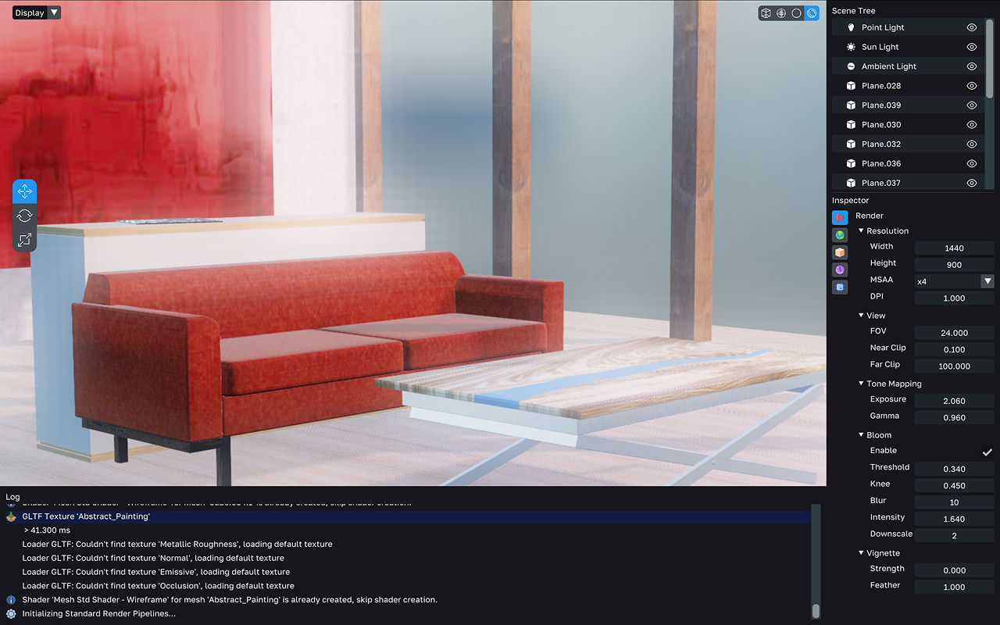
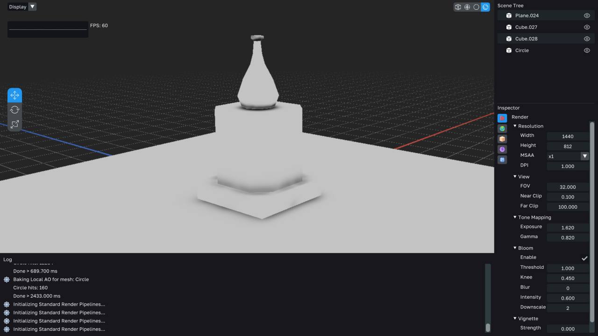
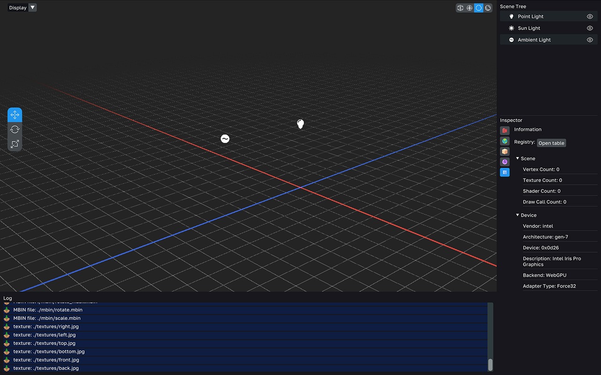
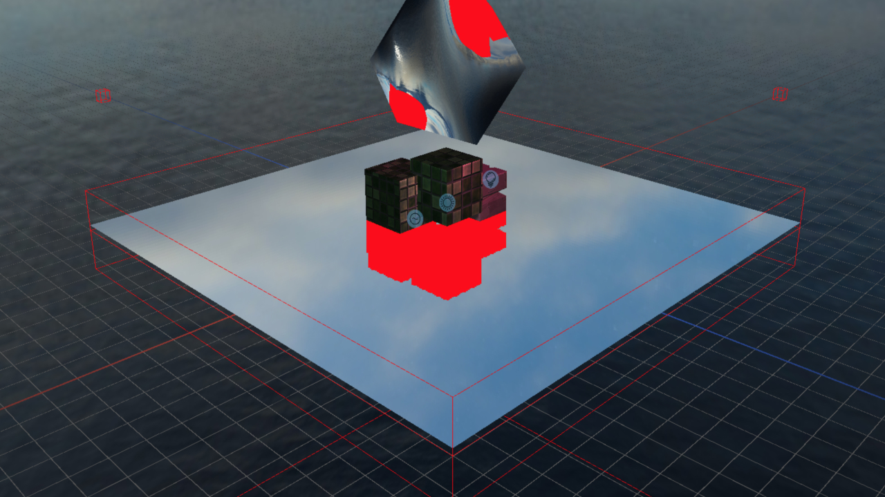
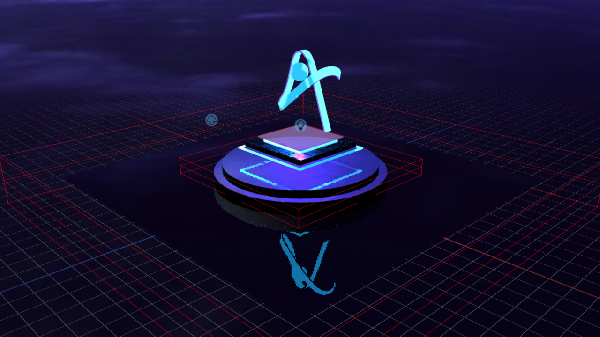
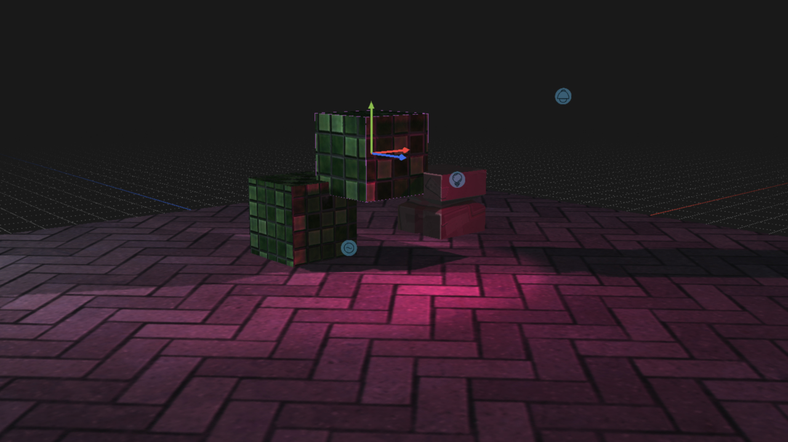
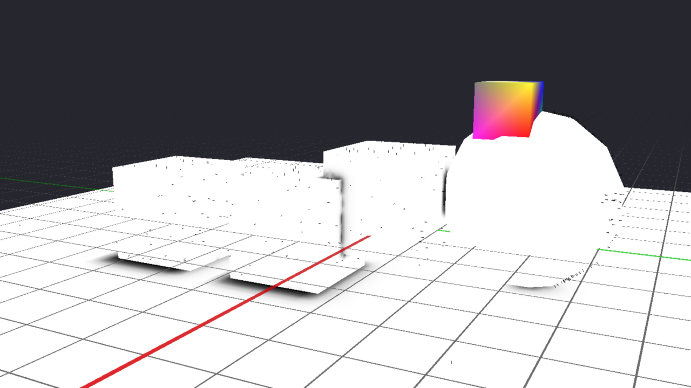
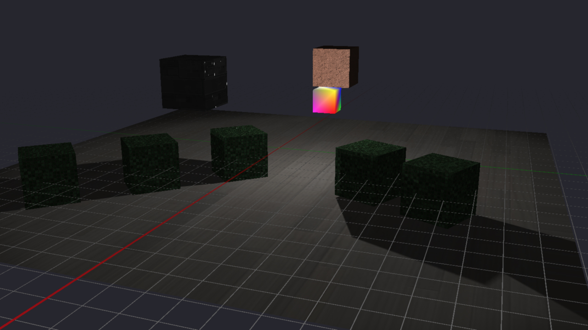
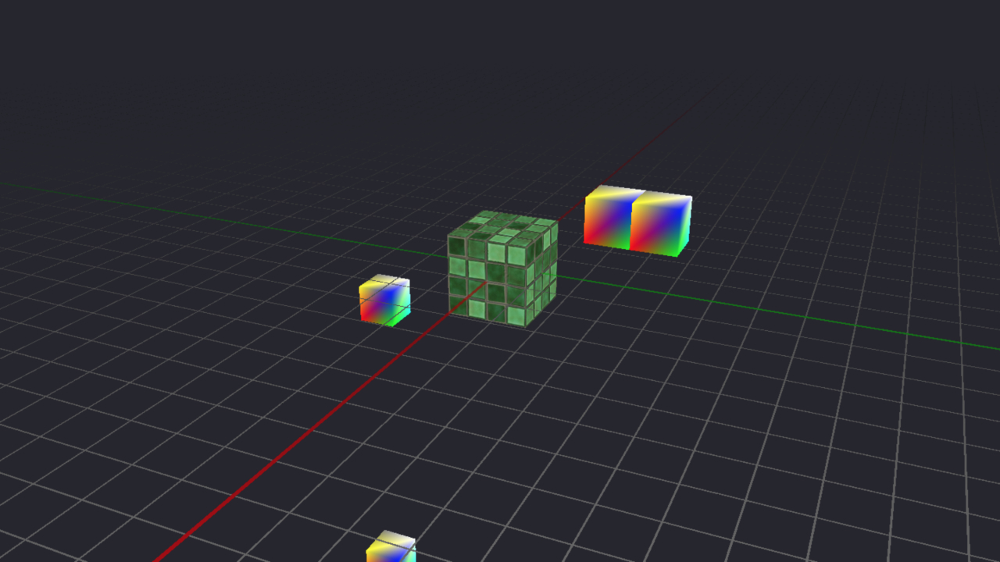

# WebGPU 3D Engine

A web-based 3D engine written in C/C++ and compiled to WASM, built around WebGPU for tight memory and performance control. The project pairs a Data-Oriented, ECS-based core with an ImGui-driven editor for development and debugging.

## Project Framing

The engine is an experimental R&D project rather than a production-ready product. It's still in active development, currently used to explore techniques (reflections, ambient occlusion, post-processing) and build WebGPU expertise that can later feed into higher-level tools like Three.js.

## Installation

Not available yet since the project is still in development. The setup instructions will be added once a first usable build is ready.

## Log

**12 december 2025**

Added blit and post-processing effects: bloom, gamma correction, exposure, and dynamic multisample/resolution update.

---

**24 november 2025**

Refined ambient occlusion raytracing, speeding up the baking process by 87%.

---

**14 october 2025**

Implemented the Editor UI in C++ with ImGui for faster productivity. The UI includes a tree view, rendering modes (bounding box, wireframe, solid, textured), inspector attributes, plus a log and profiler. 

I am considering a switch to a React-based interface for faster future iteration, however the communication with the core engine will be trickier.

---

**4 september 2025**

Added probe & planar reflections (in progress). I used a Kawase blur to blur the downscaled reflection render, however it's still fairly slow.

---

**28 august 2025**

Added Gizmo / lights / cameras UI.

---

**5 may 2025**

First attempt at ambient occlusion baking via raytracing. It's quite slow, and results are not good enough. 
Furthermore, baking AO directly on the model would require a UV editor, which means offering more mesh-editing control than the project's scope and timeline allow, so I am considering baking AO directly in Blender instead.

---

**19 april 2025**

Implemented shadow mapping.

---

**23 march 2025**

Basic geometry loading (glTF) with flat shading.

